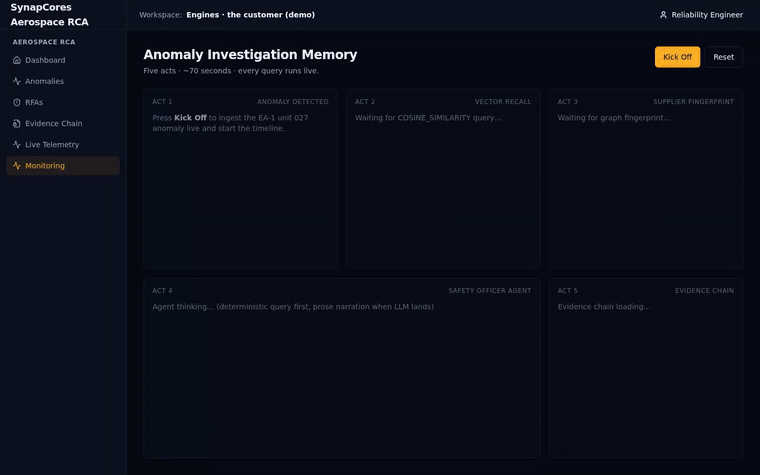

# aerospace-rca — SynapCores AIDB vertical demo



> The `/demo` route above runs live against a real engine — every act is a real
> query. One anomaly lands, vector recall surfaces near-identical past incidents,
> a graph traversal fingerprints the shared supplier across programs, an
> in-database agent surfaces the stale RFAs and a departed-employee owner, and an
> immutable Merkle-chained evidence spine makes it audit-defensible. All five run
> in a single engine. ([full-resolution still](docs/media/demo-complete.png))

A complete reference implementation of an **aerospace anomaly Root Cause
Analysis** application built on [SynapCores AIDB](https://github.com/SynapCores/synapcores).
Demonstrates how to combine SQL, vector similarity, graph traversal,
immutable audit, and in-database AI agents — all in one engine — to
build a credible investigation workflow.

This repo is intentionally structured as a **template** for anyone
building a vertical app on AIDB. It mirrors the same monorepo shape used
by the SynapCores SOAR and AML apps:

- A reusable framework at `packages/app-framework/` (auth, RBAC, shared
  UI, agent dispatch) — vendored here so the demo is self-contained.
- Two domain apps at `apps/`:
  - **`apps/aerospace-rca/`** — Next.js 15 investigation app. Anomaly
    list, RCA workspace, force-graph supplier fingerprint, immutable
    evidence chain, agentic personas, 5-act cinematic playback at
    `/demo`.
  - **`apps/telemetry-bridge/`** — Node WebSocket service that ingests
    a simulated 3 000-sensor × 100 Hz telemetry stream, runs z-score
    anomaly detection in a sliding window, batches 1 Hz aggregates to
    AIDB, and promotes detections into the investigation table so
    cross-program memory queries surface them.

The two apps connect through SynapCores AIDB — the only shared state.

---

## Run it with Docker (one command)

The fastest path — engine + bridge + app, fully wired:

```sh
git clone git@github.com:SynapCores/synapcores-aerospace-rca.git
cd synapcores-aerospace-rca

cp .env.example .env
# edit .env: set AIDB_JWT_SECRET (e.g. `openssl rand -base64 32`)
#            and AIDB_ADMIN_PASSWORD

docker compose up --build
```

First run pulls the engine image, builds the app + bridge, applies the
schema, and seeds the corpus — give it a few minutes. Then open:

- **http://localhost:3005/demo** — 5-act cinematic playback
- **http://localhost:3005/dcu** — live telemetry detection

**How auth is wired:** the engine mints an admin token on boot (signed
with `AIDB_JWT_SECRET`) for the `admin` user, whose password you pin via
`AIDB_ADMIN_PASSWORD`. The app and bridge log in with that password at
startup (`POST /v1/auth/login`, see each service's `bin/aidb-login.mjs`)
to obtain the token — nothing is baked into an image. To swap the
simulated upstream for a real OpenC3 COSMOS feed, set `BRIDGE_SOURCE=cosmos`
(see `apps/aerospace-rca/docs/REAL-TELEMETRY.md`).

The manual / bare-metal path below remains available if you'd rather run
the engine and apps yourself.

---

## Prerequisites

| | |
|---|---|
| **Node.js** | ≥ 20.0 (we test on 20 + 22) |
| **pnpm** | ≥ 9.0 — `corepack enable && corepack prepare pnpm@latest --activate` |
| **SynapCores AIDB** | v1.8.3 or later, with `EMBED()`, `COSINE_SIMILARITY()`, Cypher `MATCH`, `IMMUTABLE TABLE`, and `AGENT_RUN()` available |
| **Embedding model** | `all-minilm:latest` (384-dim) — the seed corpus and schema are calibrated against it |
| **OS** | Linux or macOS (Windows works under WSL2; native Windows untested) |

### Start AIDB

Easiest path — Docker:

```sh
docker run -d --name aidb \
  -p 8081:8081 \
  -v $PWD/aidb-data:/data \
  -e AIDB_JWT_SECRET="$(openssl rand -base64 32)" \
  -e AIDB_ACCEPT_LICENSE=1 \
  synapcores/community:latest
```

Or follow the bare-metal install at
[get.synapcores.com](https://get.synapcores.com).

Quick health check:

```sh
curl -s http://127.0.0.1:8081/health
# → {"status":"ok","timestamp":"…"}
```

### Pre-pull the embedding model

The seed script computes 384-dim embeddings inline. If the model isn't
already cached, the first `EMBED()` call has a multi-second cold-start.
Pre-pull it to make `seed-demo` fast:

```sh
docker exec aidb synapcores pull all-minilm:latest
# or, native install:  synapcores pull all-minilm:latest
```

---

## Quick start (clone → demo in ~3 minutes)

```sh
git clone git@github.com:SynapCores/synapcores-aerospace-rca.git
cd synapcores-aerospace-rca

# 1. Install everything (workspace deps, including vendored framework)
pnpm install

# 2. Configure the engine connection
cp apps/aerospace-rca/.env.example apps/aerospace-rca/.env.local
$EDITOR apps/aerospace-rca/.env.local       # set SYNAPCORES_URL + SYNAPCORES_ADMIN_API_KEY

# 3. Apply the aerospace-rca schema (10 tables)
pnpm --filter @synapcores/aerospace-rca bootstrap

# 4. Load the corpus: 44 anomalies, 29 parts, 15 suppliers, 25 corrective
#    actions, 15 RFAs, 3 departed employees, 3 000 telemetry sensors,
#    plus the supplier-batch story baked into the cosine vocabulary
pnpm --filter @synapcores/aerospace-rca seed-demo

# 5. (Optional) start the telemetry bridge in a second terminal — only
#    needed for /dcu live-telemetry demo
cp apps/aerospace-rca/.env.local apps/telemetry-bridge/.env.local
pnpm --filter @synapcores/telemetry-bridge dev    # → ws://localhost:4005

# 6. Start the Next.js app
pnpm --filter @synapcores/aerospace-rca dev       # → http://localhost:3005
```

Then open one of:

| URL | What you'll see |
|---|---|
| http://localhost:3005/dashboard | counter cards: open anomalies, similar-pattern hits, RFAs > 90 days, evidence-chain integrity |
| http://localhost:3005/anomalies | filterable DataTable of all 44 anomalies (by program, severity) |
| http://localhost:3005/anomalies/ANM-2026-EA1-027 | the headline detail page — similar-past panel, supplier-fingerprint graph, agent findings, evidence trail |
| http://localhost:3005/rfas | RFA backlog list with age + owner |
| http://localhost:3005/audit | immutable evidence chain |
| http://localhost:3005/demo | **5-act cinematic playback** — click *Kick Off* and watch the story land in ~70 s |
| http://localhost:3005/dcu | **live telemetry** — click *Start Test* for 90 s of simulated 3 K-sensor stream with 4 planted anomalies; alerts auto-promote into the investigation table |

---

## What the 5-act demo actually does

Each act runs **live SQL** against AIDB — no mocks, no canned data.

| Act | Surface | What runs under the hood |
|---|---|---|
| 1 — *Anomaly detected* | live feed widget | `INSERT INTO anomalies … EMBED(description)` ingests today's EA-1 unit 027 incident |
| 2 — *Semantic recall* | 5 ranked rows with similarity bars | `SELECT … COSINE_SIMILARITY(embedding, …) ORDER BY sim DESC` — returns 4 prior matches across EA-1, LH-0, HL-1 programs |
| 3 — *Supplier fingerprint* | `react-force-graph-2d` | Cypher `MATCH (a:Anomaly)-[:OCCURRED_ON]->(p:Part)-[:SUPPLIED_BY]->(s:Supplier)` — surfaces the cross-program supplier-batch link |
| 4 — *Bureaucracy reveal* | agent finding card | `AGENT_RUN('safety_officer', task)` — surfaces a stale RFA whose owner left the company |
| 5 — *Tamper-evident export* | scrolling immutable rows | reads `evidence_chain` (an `IMMUTABLE TABLE` — try `DELETE` and watch the engine refuse) |

Useful SQL you can run yourself (against `:8081`) to inspect what's
actually in the database:

```sql
-- Anomaly count (44 from seed; grows as live alerts get promoted)
SELECT COUNT(*) FROM anomalies;

-- The headline cosine recall — these scores are deterministic on a
-- fresh seed (within ±0.005)
SELECT unit_id, program,
       COSINE_SIMILARITY(embedding,
         (SELECT embedding FROM anomalies WHERE id='ANM-2026-EA1-027')) AS sim
FROM anomalies
WHERE id != 'ANM-2026-EA1-027'
ORDER BY sim DESC
LIMIT 5;

-- Prove the immutable table refuses mutation
DELETE FROM evidence_chain WHERE id = 'anything';
-- → engine error, append-only

-- The "bureaucracy reveal" the agent surfaces in Act 4
SELECT id, days_open, owner, status
FROM rfas
WHERE status = 'open' AND days_open > 200
ORDER BY days_open DESC;
```

---

## Architecture

```
                        ┌──────────────────────────────┐
                        │      SynapCores AIDB         │
                        │     (one engine, one         │
                        │      binary on :8081)        │
                        │                              │
                        │   SQL · vectors · graph ·    │
                        │   immutable · agents · ML    │
                        └───────────────▲──────────────┘
                                        │ HTTP / JSON via
                                        │ @synapcores/sdk
                                        │
        ┌───────────────────────────────┼──────────────────────────────┐
        │                               │                              │
┌───────┴────────┐         ┌────────────┴───────────┐    ┌─────────────┴────────┐
│  Next.js app   │         │   telemetry-bridge      │    │   pnpm scripts        │
│  apps/         │         │   apps/                 │    │   apps/aerospace-rca/ │
│  aerospace-rca │◄─WS────►│   telemetry-bridge      │    │   bin/{bootstrap,     │
│  :3005         │ 4005    │   :4005                 │    │    seed-demo}.mjs     │
└────────────────┘         └─────────────────────────┘    └───────────────────────┘
        │                          ▲
        │                          │ WebSocket — sim → bridge
        ▼                          │
   browser UI                Web Worker — 3K sensors × 100 Hz,
   (force graph,            simulated, plants 4 anomalies in 90 s
    sparklines, etc)
```

- **Database client**: `apps/aerospace-rca/src/lib/db.ts` uses the
  official `@synapcores/sdk` npm package (v0.4.x) with a thin wrapper
  that maps positional row tuples into keyed objects.
- **Tenant model**: this demo runs in single-tenant mode (one demo
  database, one admin-class API key). The framework supports multi-
  tenant for production deployments — see `packages/app-framework/src/auth/`.
- **Framework**: vendored at `packages/app-framework/` so this repo is
  fully self-contained. It's the same code that powers SynapCores SOAR
  and AML; we just keep our own copy here so a `pnpm install` doesn't
  need to reach into another repo.

---

## Configuration reference

Both apps read these from `.env.local` (Next.js convention):

| Var | Used by | Required | Default |
|---|---|---|---|
| `SYNAPCORES_URL` | both apps | yes | `http://127.0.0.1:8081` |
| `SYNAPCORES_ADMIN_API_KEY` | both apps | **yes** | — |
| `DCU_AGGREGATE_PERIOD_MS` | telemetry-bridge only | no | `5000` (drop to `1000` for higher-load demos) |

`SYNAPCORES_ADMIN_API_KEY` must be a valid JWT or API key against your
AIDB instance. The bare-metal install prints one in the first-boot
banner; for Docker, see the
[engine docs](https://docs.synapcores.com/auth).

---

## Common issues

**`pnpm install` fails on a `workspace:*` not found error.**
You probably have a partial clone. Confirm `packages/app-framework/`
exists at the repo root.

**`bootstrap` errors with `Table 'anomalies' already exists`.**
That's expected on a re-run — bootstrap is idempotent and treats
"already in place" rows as a no-op.

**`seed-demo` is slow or fails with a timeout.**
The first `EMBED()` call cold-starts the `all-minilm` model in the
engine. Pre-pull it (see *Prerequisites* above).

**Cosine similarity returns suspiciously low scores (~0.4 for matches
that should be ~0.9).**
You have a dimension mismatch — your `[query.ai_service].embedding_model`
isn't `all-minilm` (384-dim). The schema declares `VECTOR(384)`.

**`/dcu` won't connect — `WebSocket connection failed`.**
The telemetry-bridge isn't running. Start it with
`pnpm --filter @synapcores/telemetry-bridge dev` in a second terminal.
The Next.js app builds the bridge URL from `window.location.hostname`
so it follows whichever host you load `/dcu` from.

**`SELECT GENERATE(...)` works but `AGENT_RUN(...)` crashes.**
Known on some pre-v1.8.4 builds on macOS. Set
`AIDB_CHAT_AGENTIC_MODE=false` on the engine to disable the tools
path, or upgrade to v1.8.4+.

---

## Repo layout

```
synapcores-aerospace-rca/
├── README.md                              ← you are here
├── package.json                           ← workspace root
├── pnpm-workspace.yaml                    ← maps apps/* + packages/*
├── packages/
│   └── app-framework/                     ← vendored framework
│       └── (auth, RBAC, agent, UI, layout, …)
└── apps/
    ├── aerospace-rca/                     ← the Next.js demo app
    │   ├── bin/{bootstrap,seed-demo,playback}.mjs
    │   ├── docs/STORYBOARD.md             ← 5-act script with the queries
    │   ├── src/
    │   │   ├── app/(app)/                 ← Next.js routes (dashboard, demo, …)
    │   │   ├── app/api/v1/                ← REST handlers used by the UI
    │   │   ├── lib/
    │   │   │   ├── db.ts                  ← @synapcores/sdk wrapper
    │   │   │   ├── agent.ts               ← deterministic agent personas
    │   │   │   ├── anomalies.ts           ← SQL helpers
    │   │   │   ├── graph.ts               ← Cypher supplier-fingerprint
    │   │   │   ├── audit.ts               ← immutable evidence chain
    │   │   │   ├── schema.sql             ← the 10-table domain schema
    │   │   │   └── seed/                  ← authored corpus (JSON)
    │   │   │       ├── anomalies.json
    │   │   │       ├── parts.json
    │   │   │       ├── suppliers.json
    │   │   │       ├── corrective_actions.json
    │   │   │       ├── rfas.json
    │   │   │       ├── departed_employees.json
    │   │   │       └── sensors.json       ← 3 000 sensor registry
    │   │   └── …
    │   └── README.md                      ← app-specific notes
    └── telemetry-bridge/
        ├── src/
        │   ├── index.ts                   ← WS server entry
        │   ├── bridge.ts                  ← LRU ring buffer + batcher
        │   ├── detection.ts               ← z-score detector + debounce
        │   └── aidb-client.ts             ← AIDB writes via SDK
        └── README.md                      ← bridge architecture notes
```

---

## License

Apache-2.0. See `LICENSE`.
